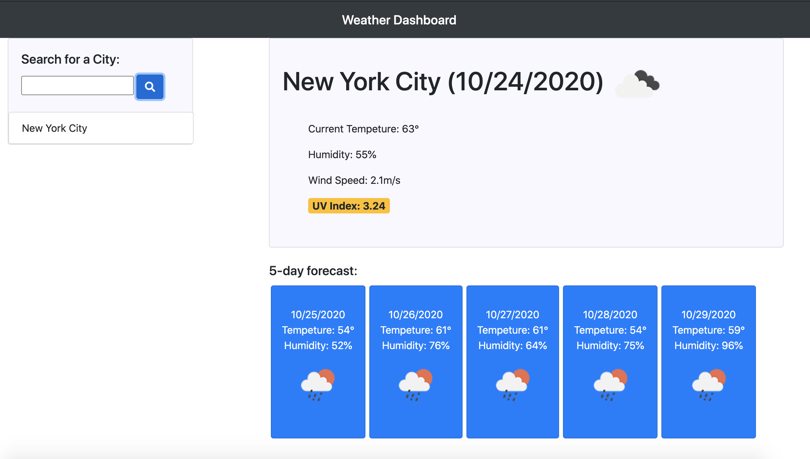

# taperWeatherApp

## The What

Welcome to the Dashboard Weather app.  This application allows you to type in any city in the search bar and will automatically generate the cities current tempeture, humidity percentage, wind speed in meters per second and the current UVI index.  The page will also render the next 5 day forecast with shorthand information on the tempeture and humidity.  Don't get caught in the rain without your umbrella!  

## The Why 

This application is very useful as it allows you to have weather data available at your fingertips.  There is a color-coded visual identifier in the UVI index allowing the user quickly see if the UVI is favorable - green, cautious - yellow, and dangerous - red.  All searched cities will appear in the search field under the search for a city input and it is also clickable allowing the user to quickly bring up data of a previously searched city.  On reload of the page, if the user has used this app before, it will autmatically load the last city that was searched. 

## The How 

First, type in a city in the search for a city field.  Your cities weather data will show to the right and the five day forecase just below.  Its that easy!  

## The Where 

If there are any questions or concerns with this applciaiton, please reach out to me directly, as I own, manage and will contribute to this project.  Thank you for reading and for stopping by!  Here is a link to the application for convenience.  https://johnsondavid1107.github.io/taperWeatherApp/

## The When
Applicaiton is ready for use!  Use now! 

• 
